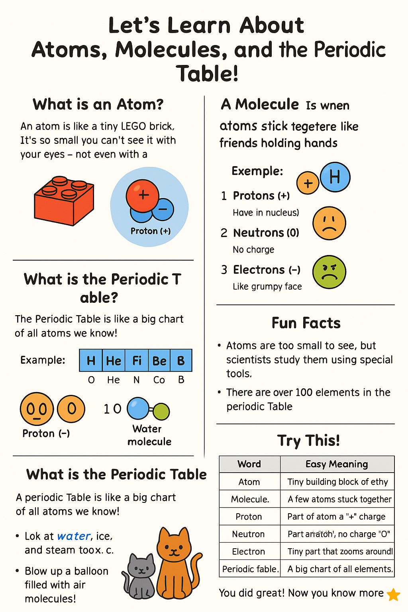

# 🧪 Let's Learn About Atoms, Molecules, and the Periodic Table!

Hi there! 👋  
Today, we’re going to learn something super cool — the building blocks of everything around us!

---

## 🧱 What is an Atom?

An **atom** is like a tiny LEGO brick. It’s **so small** you can’t see it with your eyes — not even with a normal microscope! 🧲

Every single thing — the air, your toys, your water bottle, and even YOU — is made of **atoms**.

### 🖼️ Atom Diagram

---

## 🧑‍🤝‍🧑 What is a Molecule?

A **molecule** is when **atoms stick together** like friends holding hands 🤝.

### Example:

Water is made of:
- 2 Hydrogen atoms (H)
- 1 Oxygen atom (O)

So a water molecule looks like: **H₂O**

---

## ⚛️ What’s Inside an Atom?

Atoms are made of even **smaller parts** called:

### 1. **Protons** (+)
- They live in the center (called the **nucleus**)
- They have a **positive charge** (like a happy face 😊)

### 2. **Neutrons** (0)
- Also in the center
- They have **no charge** (like a sleepy face 😴)

### 3. **Electrons** (–)
- They **zoom around** the center really fast! 🌀
- They have a **negative charge** (like a grumpy face 😠)

---

## 🧪 What is the Periodic Table?

The **Periodic Table** is like a **big chart** of all the atoms we know!  
Each box shows a different kind of atom — called an **element**.

Examples of elements:
- **O** = Oxygen (helps you breathe! 🫁)
- **H** = Hydrogen (found in water 💧)
- **C** = Carbon (part of all living things 🌿)

### 🖼️ Simple Periodic Table (Top Row)

---

## 🎨 Fun Facts

- Atoms are **too small to see**, but scientists can study them using special tools!
- There are **over 100 elements** in the periodic table!
- You are made of atoms too — so you're part of science! 🧑‍🔬

---

## 🧠 Try This!

- Look at water, ice, and steam. They all look different, but they are all made of the same **H₂O molecules**!
- Blow up a balloon — it’s filled with **air molecules**!
- Everything around you — even your pets — are made of atoms! 🐶 🐱

---

## 📚 More Cool Words

| Word       | Easy Meaning                          |
|------------|----------------------------------------|
| Atom       | Tiny building block of everything      |
| Molecule   | A few atoms stuck together             |
| Proton     | Part of atom, has a "+" charge         |
| Neutron    | Part of atom, has no charge "0"        |
| Electron   | Tiny part that zooms around, "-" charge|
| Periodic Table | A big chart of all elements        |

---

🌟 You did great! Now you know more about the tiny things that make up our BIG world!
